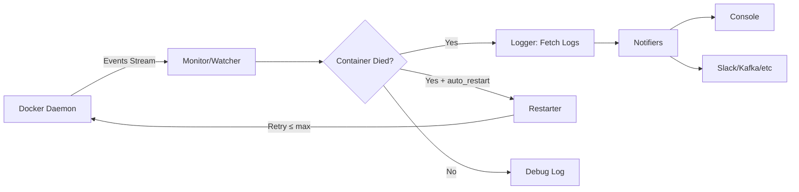

<p align="center">
  <h1 align="center">🐕 docker-watchdog</h1>
  <p align="center">
    <strong>A high-performance Docker container monitor written in Rust</strong>
  </p>
  <p align="center">
    
    
    
    
  </p>
</p>

---

**docker-watchdog** monitors your Docker containers in real-time, captures crash logs, sends alerts, and optionally auto-restarts failed containers — all with near-zero resource overhead thanks to Rust's async runtime.

## ✨ Features

- 🔍 **Real-time event monitoring** — Streams Docker events via the native API
- 📋 **Crash log capture** — Fetches last N lines of logs when a container dies
- 🔄 **Auto-restart** — Automatically restarts failed containers with configurable retry limits
- 🔌 **Extensible notifiers** — Trait-based notification system (console, Slack, Kafka, etc.)
- ⚡ **Blazing fast** — Zero-cost abstractions, async I/O, minimal memory footprint
- 🧪 **Well-tested** — 24 unit tests covering config, events, and utilities

## 📁 Project Structure

```
src/
├── main.rs              # Entry point
├── lib.rs               # Library root
├── config/              # Configuration (env vars, defaults)
│   ├── mod.rs
│   └── settings.rs
├── docker/              # Docker client & typed events
│   ├── mod.rs
│   ├── client.rs
│   └── events.rs
├── logger/              # Tracing setup & container log fetching
│   ├── mod.rs
│   ├── setup.rs
│   └── container_logs.rs
├── monitor/             # Core event loop & dispatch
│   ├── mod.rs
│   └── watcher.rs
├── notifier/            # Extensible notification system
│   ├── mod.rs
│   ├── traits.rs
│   └── console.rs
├── restarter/           # Auto-restart logic with retry tracking
│   ├── mod.rs
│   └── engine.rs
└── utils/               # Shared helpers
    ├── mod.rs
    └── helpers.rs
```

## 🚀 Quick Start

### Prerequisites

- [Rust](https://rustup.rs/) 1.85+
- [Docker Desktop](https://www.docker.com/products/docker-desktop/) (running)

### Run

```bash
# Clone the repo
git clone https://github.com/yourusername/docker-watchdog.git
cd docker-watchdog

# Run the watchdog
cargo run
```

### Test it

In a second terminal, spin up a container that intentionally crashes:

```bash
docker run --rm --name failing-test alpine sh -c "echo 'Something went wrong!' && exit 1"
```

You should see the watchdog detect the crash and print the logs:

```
INFO  🐕 docker-watchdog v0.1.0
INFO  🔍 Watching for Docker container events...
INFO  ⚠️  Container 'failing-test' (a1b2c3d4e5f6) action='die' exit_code=1
WARN  🚨 ALERT: Container 'failing-test' (a1b2c3d4e5f6) action='die' exit_code=1
WARN  ❌ Container 'failing-test' exited with a non-zero exit code!
WARN  📋 Last logs:
      Something went wrong!
```

## ⚙️ Configuration

All config is via environment variables, with sensible defaults:

| Variable | Default | Description |
|---|---|---|
| `WATCHDOG_LOG_LEVEL` | `info` | Log level (`debug`, `info`, `warn`, `error`) |
| `WATCHDOG_LOG_TAIL` | `50` | Number of log lines to fetch on failure |
| `WATCHDOG_AUTO_RESTART` | `false` | Enable auto-restart (`true`/`1`) |
| `WATCHDOG_MAX_RESTARTS` | `3` | Max restart attempts per container |
| `WATCHDOG_RESTART_DELAY` | `5` | Seconds to wait before restarting |
| `WATCHDOG_NO_COLOR` | `false` | Disable colored output |

### Example with auto-restart

```powershell
$env:WATCHDOG_AUTO_RESTART = "true"
$env:WATCHDOG_MAX_RESTARTS = "5"
$env:WATCHDOG_RESTART_DELAY = "10"
cargo run
```

## 🧪 Running Tests

```bash
cargo test -- --test-threads=1
```

> Note: `--test-threads=1` is required because some tests modify environment variables.

```
running 24 tests
test result: ok. 24 passed; 0 failed; 0 ignored
```

## 🏗️ Architecture



## 🔌 Adding a Custom Notifier

Implement the `Notifier` trait to add new notification channels:

```rust
use async_trait::async_trait;
use docker_watchdog::docker::ContainerEvent;
use docker_watchdog::notifier::Notifier;

pub struct SlackNotifier { webhook_url: String }

#[async_trait]
impl Notifier for SlackNotifier {
    fn name(&self) -> &str { "slack" }

    async fn notify(&self, event: &ContainerEvent, logs: &str) -> Result<(), String> {
        // Send to Slack webhook...
        Ok(())
    }
}
```

Then register it in `main.rs`:

```rust
let notifiers: Vec<Box<dyn Notifier>> = vec![
    Box::new(ConsoleNotifier::new()),
    Box::new(SlackNotifier { webhook_url: "https://...".into() }),
];
```

## 📜 License

MIT

## 🤝 Contributing

1. Fork the repo
2. Create a feature branch (`git checkout -b feature/amazing-feature`)
3. Commit your changes (`git commit -m 'Add amazing feature'`)
4. Push to the branch (`git push origin feature/amazing-feature`)
5. Open a Pull Request
